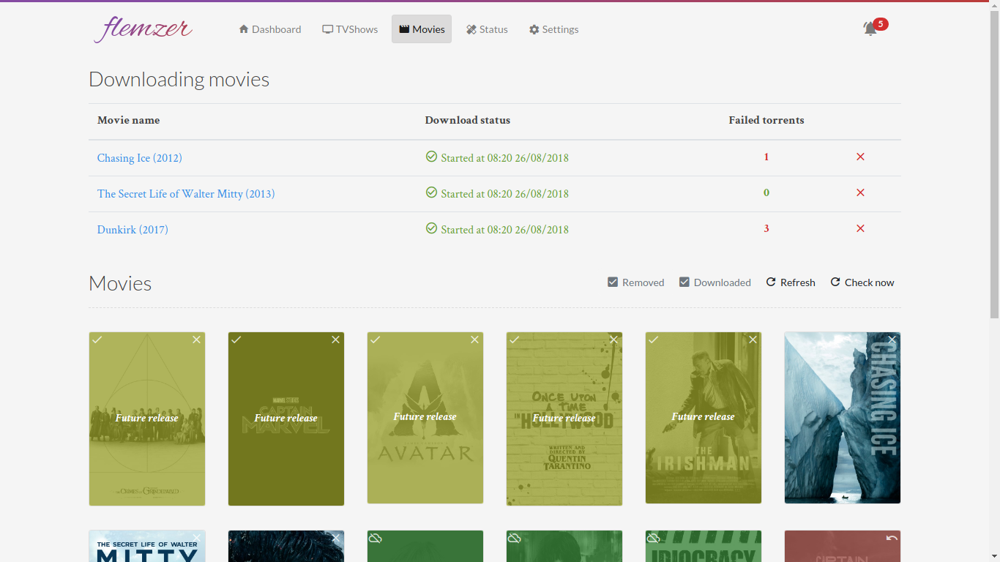

# Flemzerd [](https://travis-ci.org/macarrie/flemzerd/) [](https://codecov.io/gh/macarrie/flemzerd)

> Flemzerd is an automation tool (like a very lightweight Sonarr) for handling TV Shows.
> It watches your tv shows for new episodes, downloads them in the client of your choices, and updates your media center library if needed.


Flemzerd is a daemon intended to track and handle your media library. We are often doing the same thing by hand:
* Look regularly for new episodes of tv show
* Once an episode is available, look for a way to download it
* Launch download in your download client and wait for the download to end
* Move the episode wherever you store your media and manually update your media center (refresh Kodi library for example)

Flemzerd is intended to automate these tasks.



## Documentation

The documentation containing detailed setup instructions, explanations and details about modules is accessible at [https://macarrie.github.com/flemzerd/](https://macarrie.github.com/flemzerd/).

## Installation

* Extract the package downloaded from the [Releases](https://github.com/macarrie/flemzerd/releases)
* ```make install```

## Update

* Extract the package downloaded from the [Releases](https://github.com/macarrie/flemzerd/releases)
* ```make update```

## Usage

* Use the binary directly:
    ```./flemzerd -d```
* Use the installed systemd service
    ```systemctl start flemzerd```
* Use the docker compose configuration found in the package. This contains all dependencies (Jackett, Transmission and preconfiguration)
    ```docker-compose up```

See the documentation for more details

## Release history

No release yet, flemzerd is still in development

## Contribute

Contributions are welcomed:
* Fork the project
* Create a branch corresponding to your feature/bugfix
* Create a Pull Request containing an explanation of the changes and their motives

More informations about development setup can be found on the corresponding documentation page: [Development setup](https://macarrie.github.com/flemzerd/docs/devsetup)
